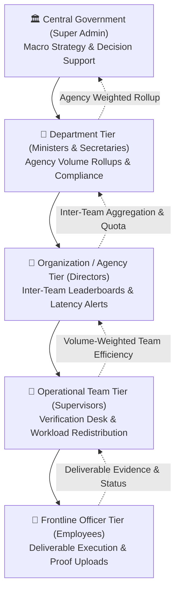

# 🏛️ GovernScale — E-Office Productivity Alignment OS

> **SIH Problem Statement Reference**: SIH25250 — E-Office Productivity Alignment Module  
> **Official Project Milestone & Notice**:  
> This project was engineered as a comprehensive, production-grade prototype for **Internal SIH Level 1 Evaluation**. Active development on this repository has concluded / frozen because our team is now transitioning to solve the newly published **Official Smart India Hackathon (SIH) 2026 Problem Statement** for our **Internal SIH Level 2**.

---

## 📑 Table of Contents

1. [Executive Summary](#-executive-summary)
2. [SIH Hackathon Context & Status Notice](#-sih-hackathon-context--status-notice)
3. [System Architecture & 5-Tier Hierarchy](#-system-architecture--5-tier-hierarchy)
4. [Mathematical Scoring Engine (Zero Black-Box AI)](#-mathematical-scoring-engine-zero-black-box-ai)
5. [Client-Side Data Architecture & LocalStorage Engine](#-client-side-data-architecture--localstorage-engine)
6. [Complete Repository Folder Structure](#-complete-repository-folder-structure)
7. [Comprehensive Technology Stack](#-comprehensive-technology-stack)
8. [Feature Breakdown by Administrative Tier](#-feature-breakdown-by-administrative-tier)
9. [Decision-Support & Bottleneck Detection Engine](#-decision-support--bottleneck-detection-engine)
10. [Getting Started & Local Setup](#-getting-started--local-setup)
11. [Demo Persona Credentials & Roles](#-demo-persona-credentials--roles)
12. [Future Roadmap (SIH 2026 Transition)](#-future-roadmap-sih-2026-transition)

---

## 📌 Executive Summary

**GovernScale** is an evidence-based, hierarchical governance productivity operating system designed to align high-level national and state directives with frontline administrative execution. Built to eliminate bureaucratic opacity and subjective appraisals, GovernScale introduces a deterministic, 4-pillar mathematical scoring engine, fair SLA delay protection for inter-departmental holding times, volume-weighted efficiency roll-ups, and automated bottleneck detection across all 5 administrative tiers of government.



---

## 🎖️ SIH Hackathon Context & Status Notice

> [!IMPORTANT]
> ### 🏁 SIH Internal Level 1 Milestone Reached
> - **Hackathon Phase**: Developed and successfully presented for **Internal SIH Level 1**.
> - **Scope Delivered**: All 5 administrative tiers, 35 protected routes, pure mathematical scoring formulas, proactive bottleneck redistribution algorithms, decision-support module, and reactive client-side data persistence.
> - **Current Status**: **Project Development Concluded / Frozen**.  
>   Our team has completed the requirements for Level 1 and is officially pivoting to tackle the **actual official 2026 Smart India Hackathon (SIH) Problem Statement** for **Internal SIH Level 2**.

---

## 🏢 System Architecture & 5-Tier Hierarchy

GovernScale structures public sector administration into five interconnected vertical tiers:

| Tier Level | Primary Persona | Core Responsibility | Dashboard Capabilities |
| :--- | :--- | :--- | :--- |
| **Tier 1: Central Government** | Cabinet Secretary / Super Admin | National mission creation, cross-departmental oversight, macro strategic steering | 5-Tier Mission Cascade Visualizer, Decision Support Engine, Central Audit Trail, Global Settings |
| **Tier 2: Department** | Cabinet Minister / Principal Secretary | Quota cascading, agency oversight, policy compliance | Agency Volume Share Breakdown, 4-Pillar Department Sub-Scores, National Mission Contribution Tracking |
| **Tier 3: Organization / Agency** | Agency Director / Commissioner | Operational execution, team capacity planning | Ranked Team Leaderboard (1st, 2nd, 3rd), Inter-Team Bottleneck Alerts, Team Quota Management |
| **Tier 4: Operational Team** | Section Officer / Team Supervisor | Supervisory audit desk, task assignment, quality assurance | Supervisory Verification Desk (Approve/Reject), Automated Workload Redistribution, Officer Rankings |
| **Tier 5: Frontline Employee** | Verification Officer / Executive Clerk | Deliverable execution, evidence proof submission | Task Queue (To-Do $\rightarrow$ In-Progress $\rightarrow$ Submitted $\rightarrow$ Verified), Evidence URL Upload, Personal Sub-Score Breakdown |

---

## 📐 Mathematical Scoring Engine (Zero Black-Box AI)

GovernScale uses transparent, deterministic mathematical formulas with zero unexplainable AI or machine learning models.

$$\text{Composite Efficiency Score} = (V \times W_v) + (T \times W_t) + (Q \times W_q) + (X \times W_x)$$

*Default Baseline Weights*: Volume ($W_v = 0.25$), Timeliness ($W_t = 0.30$), Quality ($W_q = 0.30$), Complexity ($W_x = 0.15$).

```
┌─────────────────────────────────────────────────────────────────────────────┐
│                       GOVERNSCALE 4-PILLAR SCORING FORMULA                  │
├──────────────────────┬──────────────────────┬───────────────────────────────┤
│ Pillar               │ Weight               │ Mathematical Formula          │
├──────────────────────┼──────────────────────┼───────────────────────────────┤
│ 1. Volume Output (V) │ 25%                  │ (Completed Verified / Total)  │
│ 2. Timeliness (T)    │ 30%                  │ On-Time SLA + Delay Shield    │
│ 3. Quality (Q)       │ 30%                  │ First-Pass Pass Rate vs Rework│
│ 4. Complexity (X)    │ 15%                  │ Difficulty Weighting Index    │
└──────────────────────┴──────────────────────┴───────────────────────────────┘
```

### 1. The Four Sub-Score Pillars
1. **Volume Sub-Score ($V - 25\%$)**:  
   $$\text{Volume} = \left(\frac{\text{Completed Verified Tasks}}{\text{Total Assigned Tasks}}\right) \times 100$$
2. **Timeliness Sub-Score with Fair SLA Delay Protection ($T - 30\%$)**:  
   Calculates compliance against due dates. If an administrative task is placed on hold due to external department dependencies (e.g., waiting for document clearance from another ministry), the system tracks the duration in `statusLog` and dynamically extends the effective SLA deadline:
   $$\text{Effective Deadline} = \text{Target Due Date} + \sum \text{External Delay Duration}$$
3. **Quality Compliance Sub-Score ($Q - 30\%$)**:  
   Measures evidence completeness (document links, verification notes) and first-pass acceptance:
   - *First-Pass Verified with Evidence*: 100%
   - *Approved after Supervisory Rework*: 70%
   - *Approved without Attached Evidence*: 85%
4. **Complexity Index ($X - 15\%$)**:  
   Difficulty-weighted scoring based on directive priority:
   - *High / Critical Priority*: 100 Index
   - *Medium Priority*: 70 Index
   - *Low / Routine Priority*: 40 Index

### 2. Hierarchical Bottom-Up Roll-Up Algorithms
- **Team Efficiency Roll-up (Phase 6)**:  
  $$\text{Team Score} = \frac{\sum (\text{Officer Score} \times \text{Officer Completed Tasks})}{\text{Total Team Completed Tasks}}$$
- **Organization Efficiency Roll-up (Phase 7)**:  
  $$\text{Organization Score} = \frac{\sum (\text{Team Score} \times \text{Team Completed Tasks})}{\text{Total Organization Completed Tasks}}$$
- **Department Efficiency Roll-up (Phase 8)**:  
  $$\text{Department Score} = \frac{\sum (\text{Organization Score} \times \text{Organization Completed Tasks})}{\text{Total Department Completed Tasks}}$$

---

## 💾 Client-Side Data Architecture & LocalStorage Engine

To allow instant evaluation without external database dependencies, GovernScale operates as a self-contained client-side data engine powered by `localStorage` with real-time cross-tab synchronization.

### 1. Storage Keys Schema

| Storage Key | Data Structure | Purpose |
| :--- | :--- | :--- |
| `governscale_missions` | `Array<MissionObject>` | National missions, total targets, deadlines, and assigned department lists |
| `governscale_department_allocations` | `Array<AllocationObject>` | Department-level mission quota splits and status |
| `governscale_organization_allocations` | `Array<AllocationObject>` | Agency/Organization-level quota breakdowns |
| `governscale_team_allocations` | `Array<AllocationObject>` | Operational team-level target distributions |
| `governscale_employee_allocations` | `Array<AllocationObject>` | Individual frontline officer deliverable quotas |
| `governscale_tasks` | `Array<TaskObject>` | Granular deliverables, status logs, verification proofs, evidence URLs, deadlines |
| `governscale_departments` | `Array<DepartmentObject>` | Department metadata, ministers, and codes |
| `governscale_organizations` | `Array<OrganizationObject>` | Organization hierarchy, agency heads, and parent department links |
| `governscale_teams` | `Array<TeamObject>` | Team registries, supervisors, baseline officer headcounts |
| `governscale_employees` | `Array<EmployeeObject>` | Officer directory, designations, and team affiliations |
| `governscale_audit_logs` | `Array<AuditEntryObject>` | System-wide chronological event audit trail with timestamps and user details |
| `governscale_role_weights` | `Object<RoleWeights>` | Custom 4-factor pillar weight overrides per functional role |
| `governscale_current_user` | `UserObject` | Active authenticated session and permission tier |

### 2. Reactive Event Synchronization
When data is mutated anywhere in the application (e.g., an officer submits a task or a supervisor approves a deliverable):
1. The mutation updates the relevant `localStorage` key.
2. An audit log entry is recorded in `governscale_audit_logs`.
3. A custom browser event `governscale-data-updated` is dispatched:
   ```javascript
   window.dispatchEvent(new Event("governscale-data-updated"));
   ```
4. All active components and browser tabs listening to `governscale-data-updated` and `storage` events re-fetch their data stores reactively without page reloads.

---

## 📂 Complete Repository Folder Structure

```
Governscale/
├── client/                                 # Frontend SPA Application
│   ├── public/                             # Public static assets & favicon.svg
│   ├── src/
│   │   ├── components/
│   │   │   ├── auth/
│   │   │   │   └── ProtectedRoute.jsx      # Role-Based Access Control (RBAC) wrapper
│   │   │   ├── layout/
│   │   │   │   ├── DashboardLayout.jsx     # Master responsive wrapper + Persona Dock
│   │   │   │   ├── Navbar.jsx              # Header bar with universal search engine
│   │   │   │   └── Sidebar.jsx             # Role-aware responsive navigation drawer
│   │   │   ├── ui/
│   │   │   │   ├── Badge.jsx               # Status indicators (Sage, Danger, Warning)
│   │   │   │   ├── Button.jsx              # Reusable action button with loading states
│   │   │   │   ├── Card.jsx                # Glassmorphic container card
│   │   │   │   ├── Input.jsx               # Form controls & validation wrappers
│   │   │   │   └── StatCard.jsx            # High-impact KPI widget cards
│   │   │   └── ErrorBoundary.jsx           # Global crash shield with storage reset tool
│   │   ├── data/
│   │   │   └── hierarchy.js                # Default administrative tree & seed structure
│   │   ├── pages/
│   │   │   ├── auth/
│   │   │   │   ├── AuthContext.jsx         # Global authentication state provider
│   │   │   │   ├── Login.jsx               # Multi-persona interactive login screen
│   │   │   │   └── demoUsers.js            # Pre-configured demo user accounts
│   │   │   ├── government/                 # Central Government Super-Admin Pages (13)
│   │   │   │   ├── AuditLog.jsx            # Central activity audit trail & JSON exporter
│   │   │   │   ├── DecisionSupport.jsx     # Algorithmic team recommendation engine
│   │   │   │   ├── GovernmentAnalytics.jsx # Macro national efficiency analytics
│   │   │   │   ├── GovernmentDashboard.jsx # Executive national mission command center
│   │   │   │   ├── GovernmentDepartments.jsx # Department registry & quota overview
│   │   │   │   ├── GovernmentEmployees.jsx # National officer registry
│   │   │   │   ├── GovernmentReports.jsx   # State executive audit reports
│   │   │   │   ├── GovernmentSettings.jsx  # System role weight configuration
│   │   │   │   ├── GovernmentTeams.jsx     # National team directory
│   │   │   │   ├── MissionCascade.jsx      # 5-Tier vertical cascade breakdown
│   │   │   │   ├── MissionCreation.jsx     # National mission wizard
│   │   │   │   ├── MissionManagement.jsx   # Mission editing & lifecycle management
│   │   │   │   └── OrganizationHierarchy.jsx # Visual organization hierarchy explorer
│   │   │   ├── department/                 # Department Level Pages (8)
│   │   │   │   ├── DepartmentAnalytics.jsx # Volume-weighted agency analytics
│   │   │   │   ├── DepartmentDashboard.jsx # Ministerial command workbench
│   │   │   │   ├── DepartmentEmployees.jsx # Department officer roster
│   │   │   │   ├── DepartmentMissions.jsx  # Department directive allocations
│   │   │   │   ├── DepartmentOrganizations.jsx # Constituent agency management
│   │   │   │   ├── DepartmentReports.jsx   # Departmental performance reports
│   │   │   │   ├── DepartmentSettings.jsx  # Department settings
│   │   │   │   └── DepartmentTeams.jsx     # Department teams ledger
│   │   │   ├── organization/               # Agency / Organization Level Pages (7)
│   │   │   │   ├── OrganizationAnalytics.jsx # Agency team leaderboards & latency alerts
│   │   │   │   ├── OrganizationDashboard.jsx # Agency director command center
│   │   │   │   ├── OrganizationEmployees.jsx # Agency personnel directory
│   │   │   │   ├── OrganizationMissions.jsx  # Agency mission target allocations
│   │   │   │   ├── OrganizationReports.jsx   # Agency audit reports
│   │   │   │   ├── OrganizationSettings.jsx  # Agency configuration
│   │   │   │   └── OrganizationTeams.jsx     # Agency operational teams
│   │   │   ├── team/                       # Operational Team Level Pages (6)
│   │   │   │   ├── TeamAnalytics.jsx       # Officer leaderboard & bottleneck detection
│   │   │   │   ├── TeamDashboard.jsx       # Supervisor verification desk & task assignment
│   │   │   │   ├── TeamEmployees.jsx       # Team officer roster
│   │   │   │   ├── TeamMissions.jsx        # Team directive quotas
│   │   │   │   ├── TeamReports.jsx         # Team efficiency reports
│   │   │   │   └── TeamSettings.jsx        # Team preferences
│   │   │   ├── employee/                   # Frontline Officer Level Pages (5)
│   │   │   │   ├── EmployeeDashboard.jsx   # Personal productivity score index
│   │   │   │   ├── EmployeeMissions.jsx    # Assigned directive quotas
│   │   │   │   ├── EmployeeReports.jsx     # Individual 4-factor score explanations
│   │   │   │   ├── EmployeeSettings.jsx    # Profile preferences
│   │   │   │   └── EmployeeTasks.jsx       # Interactive deliverable execution queue
│   │   │   └── NotFound.jsx                # 404 Error page
│   │   ├── utils/
│   │   │   ├── localStorage.js             # LocalStorage CRUD & benchmark seeders
│   │   │   ├── scoringEngine.js            # Pure mathematical aggregation formulas
│   │   │   └── taskEvents.js               # Cross-component event notifications
│   │   ├── App.jsx                         # 35 Protected route definitions
│   │   ├── index.css                       # Design system tokens & Tailwind CSS
│   │   └── main.jsx                        # React root entry point with ErrorBoundary
│   ├── package.json                        # Dependencies and build scripts
│   ├── vite.config.js                      # Vite build configuration
│   └── index.html                          # HTML Entry Point
└── README.md                               # Project documentation & SIH notice
```

---

## 💻 Comprehensive Technology Stack

| Layer | Technology | Purpose / Notes |
| :--- | :--- | :--- |
| **Core Framework** | `React 19.x` | Modern component architecture, hooks (`useMemo`, `useState`, `useEffect`) |
| **Build Tooling** | `Vite 8.x` | Ultra-fast Hot Module Replacement (HMR) and optimized production bundler |
| **Routing** | `React Router 7.x` | Nested routing, client-side redirection, and declarative RBAC route shields |
| **Styling & Design System** | `Tailwind CSS 4.x` | Custom green/emerald government palette (`#154B38`, `#EBF6F0`), glassmorphism |
| **Icons & Visuals** | `Lucide React` | Clean, accessible vector iconography for administrative workflows |
| **State Persistence** | `HTML5 Web Storage API` | High-performance client-side store with automated cross-tab event synchronization |
| **Error Handling** | `React ErrorBoundary` | Top-level runtime exception catching with one-click cache purge |

---

## ⚡ Feature Breakdown by Administrative Tier

### 1. Central Government Tier (Super Admin)
- **Macro Governance Dashboard**: View national progress, total deliverables completed, delayed items, and average efficiency index.
- **Mission Cascade Visualizer**: Interactive tree diagram demonstrating how a national directive splits across departments, organizations, teams, and officers.
- **Mission Management & Creation**: Create new national missions with custom targets, priorities, deadlines, and multi-department allocations.
- **Decision Support Engine**: Algorithmic team ranking for mission assignment based on historical performance, on-time SLA rate, and current team workload.
- **Central Audit Log**: Chronological audit trail of all task creations, status updates, supervisor approvals, and quota shifts with JSON export.

### 2. Department Tier (Ministers & Principal Secretaries)
- **Agency Volume-Weighted Aggregation**: Dynamic calculation weighting each constituent organization's score by its verified deliverable output.
- **Mission Delivery Tracking**: Live tracking of department fulfillment against assigned national quotas.
- **Ministerial Audit Reports**: Formal downloadable governance reports detailing agency-by-agency performance.

### 3. Organization / Agency Tier (Directors & Commissioners)
- **Ranked Team Leaderboard**: Automated 1st, 2nd, and 3rd rank badges based on team composite scores.
- **Inter-Team Latency Engine**: Real-time alert identifying progress variances between the fastest and slowest operational teams.
- **Team Quota Management**: Cascade agency targets down to specific operational sections.

### 4. Operational Team Tier (Supervisors & Section Officers)
- **Supervisory Verification Desk**: Interactive queue allowing supervisors to review submitted officer deliverables, inspect attached evidence, and approve, reject, or request rework.
- **Automated Workload Redistribution**: Proactively identifies overloaded officers with overdue tasks and recommends transferring quota units to officers with available capacity.
- **Direct Task Assignment**: Supervisor modal to assign new deliverables directly to team members.

### 5. Frontline Employee Tier (Verification Officers)
- **4-Stage Task Execution Queue**: Drag/click progression across *To-Do*, *In-Progress*, *Submitted for Verification*, and *Verified*.
- **Evidence Submission**: Officers attach evidence notes, deliverable links, and completion documentation.
- **Personal Performance Breakdown**: Visual radar and factor cards explaining personal Volume, Timeliness, Quality, and Complexity ratings.

---

## 🧠 Decision-Support & Bottleneck Detection Engine

### 1. Algorithmic Team Assignment (Decision Support)
When a department needs to assign a new high-priority directive, the **Decision Support Engine** calculates a composite **Decision Fit Score**:
1. Scans all historical tasks matching the directive's category.
2. Computes the team's historical **On-Time SLA Adherence Rate ($40\%$)**.
3. Computes the team's historical **Quality Compliance Rate ($35\%$)**.
4. Computes the team's **Available Capacity / Inverse Workload ($25\%$)**:
   $$\text{Decision Fit Score} = (\text{On-Time Rate} \times 0.40) + (\text{Quality Rate} \times 0.35) + ((100 - \text{Workload}) \times 0.25)$$

### 2. Proactive Workload Redistribution (Phase 6)
If any officer has overdue tasks or high pending loads with an efficiency score below 75, the engine flags an alert:
> *"Officer X is behind on deliverables. Recommendation: Redistribute ~20 units to Officer Y (has capacity & 88% efficiency index)."*

---

## 🚀 Getting Started & Local Setup

### Prerequisites
- **Node.js**: `v18.0.0` or higher
- **Package Manager**: `npm` (v9+) or `yarn`

### Installation Steps

1. Clone or download the repository:
   ```bash
   git clone https://github.com/your-username/Governscale.git
   cd Governscale
   ```

2. Enter the client application directory:
   ```bash
   cd client
   ```

3. Install required node dependencies:
   ```bash
   npm install
   ```

4. Launch the local Vite development server:
   ```bash
   npm run dev
   ```

5. Open your web browser and navigate to:
   ```
   http://localhost:5173
   ```

6. To build for production deployment:
   ```bash
   npm run build
   ```

---

## 🔑 Demo Persona Credentials & Roles

GovernScale includes pre-configured demo user accounts accessible directly from the **Login Page** or the **Floating Persona Dock**:

| Administrative Level | Demo Login Identifier | Default Persona Name | Default Department / Organization |
| :--- | :--- | :--- | :--- |
| **🏛️ Central Government** | `superadmin@governscale.demo` | Cabinet Super Admin | Cabinet Secretariat / Prime Ministry |
| **🏢 Department Head** | `department@governscale.demo` | Dr. Rajesh Verma | Department of Higher Education |
| **🏢 Agency Director** | `organization@governscale.demo` | Sunita Sharma | Scholarship Services Division |
| **👥 Team Supervisor** | `team@governscale.demo` | Vikram Malhotra | Verification Team Lead |
| **👤 Frontline Officer** | `employee@governscale.demo` | Priya Sharma | Senior Verification Officer |

*(Any password string will authenticate demo accounts in prototype mode).*

---

## 🔮 Future Roadmap (SIH 2026 Transition)

- [x] **Internal SIH Level 1 Prototype**: Completed (All 5 tiers, 35 routes, mathematical formulas, local storage).
- [ ] **Internal SIH Level 2 (2026 Problem Statement)**: Re-architecting backend microservices (Go/Node.js), PostgreSQL with row-level security, WebSocket push notifications, and cryptographic blockchain audit ledgers for the new SIH 2026 challenge.

---

<div align="center">
  <b>GovernScale — Engineered for Transparent, Accountable, and Evidence-Based Governance.</b><br/>
  <i>Smart India Hackathon Internal Evaluation</i>
</div>
